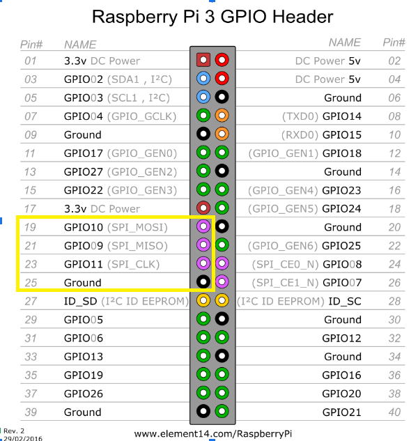

# OpenDDS-Based SmartLock demo

## About

The sources in this folder showcase OpenDDS P2P features using ICE/Stun and the RTPS Relay with a demo SmartLock application.

Currently there is an Android tablet app which communicates and controls two Raspberry Pis (mock smart-locks). The Raspberry Pis use a [Pi Traffic Light](http://lowvoltagelabs.com/products/pi-traffic/) to simulate the locked/unlocked states simply by lighting up red for unlocked and green for locked.

Some notes on the directory structure:

* _android_: Android Studio project files and Idl for SmartLock app.
* _certs_: Certificates for one tablet and two Raspberry Pis (the tablet files are also copied under android SmartLock/app/src/main/assets).
* _deploy_:  Deployment scripts for RTPS Relay on GCP.
* _dockerfiles_: Build environments for Android and Raspberry Pi.
* _src_: Source files for SmartLock application on Raspberry Pi and the core IDL files used by Android as well.

## Plugging in the pins

On the Raspberry Pi, the smart lock app uses the below (highlighted in yellow) traffic light pin assignments. Simply plug in the light so that the first pin is the 19th pin and the lights are facing outside of the case (away from the circuit board). The yellow box below shows which ones. Additionally, on the traffic light board it shows which lights are expected in GPIO pin 10, 9, 11, GND (actual pins 19, 21, 23, 25) in the order to match them up if needed.

## Getting Started

The `smart-lock` script contains a number of commands for building and deploying.

1. Create a `smart-lock-conf.sh` file.  `smart-lock-conf.sh.template` may be used as a template.
   This file defines the name, IP address, and lock id for the Raspberry Pis.
   If you want to work with the Android, you must download the Android SDK, accept the licenses (`tools/bin/sdkmanager --licenses`), and set `ANDROID_HOME` variable.

2. Enable tab completion.

    source smart-lock.inc

3. `./smart-lock [TAB][TAB]` to show the various commands.

    `./smart-lock help` to show the usage.

## Typical Use for Raspberry Pi

1. Build the cross-compiler and dependencies

        smart-lock pi build-toolchain

2. Install the dependencies

        smart-lock pi install-dependencies pi_1

3. Compile the SmartLock Demo application

        smart-lock pi compile

4. Install the SmartLock Demo application

        smart-lock pi install pi_1

5. Restart the SmartLock Demo application

        smart-lock pi restart pi_1 (or on pi: sudo systemctl restart smartlock)

6. Check the status of the SmartLock Demo application

        smart-lock pi status pi_1

## Typical Use for Android

1. Build the cross-compiler and dependencies

        smart-lock android build-toolchain [git tag or branch] // optional parameter - defaults to master branch

2. Compile the SmartLock Demo application

        smart-lock android compile

3. Install the SmartLock Demo application

        smart-lock android install

4. Start the SmartLock Demo application

        smart-lock android start

5. Check the logs for the SmartLock Demo application

        smart-lock android logs

6. Stop the SmartLock Demo application

        smart-lock android stop
